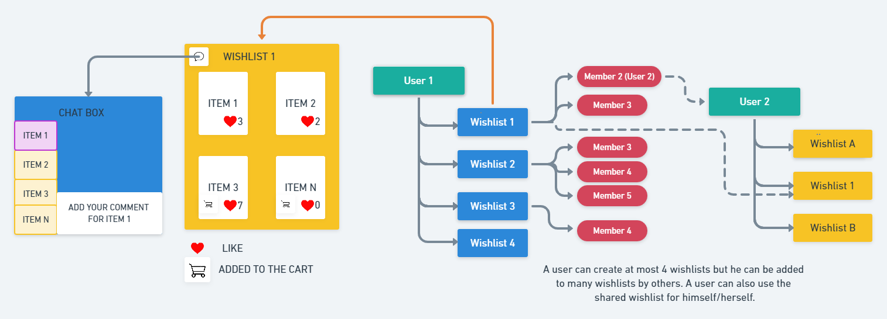
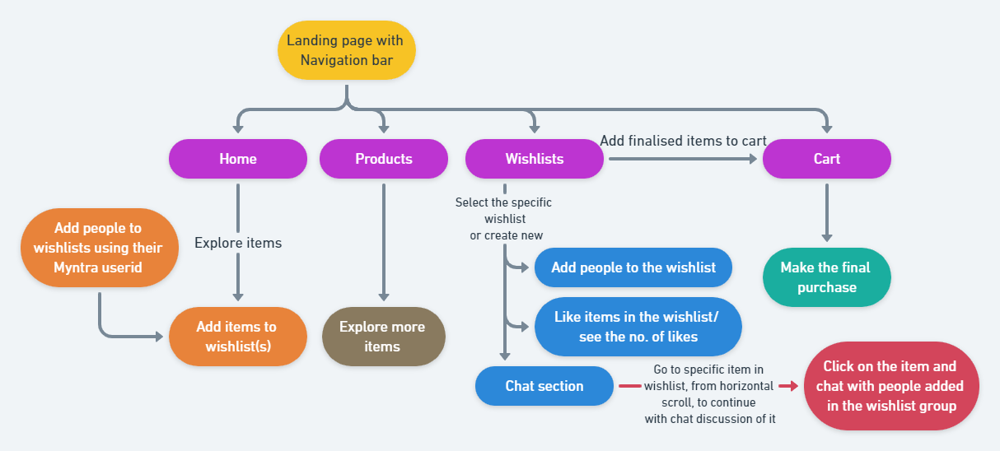

# Myntra-HackerRamp-Synchronous

>With the aim of implementing some amazing ideas, to recreate a much enhanced online shopping experience, we build this project.

## Table of Contents
* [Team members](#team-members)
* [Background of the project](#background)
* [What are the features we are looking at](#features)
* [How does it impact](#impact)
* [Technologies](#tech)
* [Implementation Skeleton/Overview](#skeleton)
* [Flow of the Sytem](#flowchart)

## Team Members
* "Sushmita Paul" <b18cs007@nitm.ac.in> @sushmita04
* "Sudha Kumari" <b18cs009@nitm.ac.in> @sudha123kumari
* "Ramneti Deepthi" <b18cs030@nitm.ac.in> @deepthi132

## Background of the project
**Problem Statement**

While we spend our time in shopping online now, we need to swap to messaging applications several times to share each item and/or get comments & suggestions on the same. At the same time, referring to those items (specially when they are more than two and they are shared as messages) becomes extremely difficult and tedious in between the chat.

We aim at creating closed groups to share wish lists within the Myntra App accordingly to get suggestions, likes & comments, and ease the user experience for referring each item while suggesting. 

**Proposed Solution**

To address the problems mentioned in the previous slide, we have a well-thought off solution. Considering an instance, a user can create at most n multiple wishlists and share them with people.  The people sharing a particular wishlist form a group and collectively add suggestions.

People in each group can like, approve and discuss/suggest on the items (all confined to themselves) in the wishlist. Now to facilitate the discussion without having to swap applications to chat, we include a feature wherein the members and the user can refer to items and chat. A horizontal/vertical scrollable display of item images is provided on every chat of the wishlist. One can click on the product’s image and switch to the  chat  specific for that particular  item. The user can move the final selection from wishlist to cart.

## What are the features we are looking at

Let owner be _user_, who can create different _groups_, people added to those groups be _members_, while items shared to those groups make a _wishlist_.
- [x] Multiple wishlists can be created to share with multiple groups (of friends, family etc) or to simply categorize products for ease.
- [x] Users can add or remove members from a group at any time.
- [x] Items can be added or removed from the wishlist at any time.
- [x] Members added to the group can like, approve and also leave comments about  the products.
- [x] Members may also add items to the wishlist created by the user.
- [x] Members of a group can communicate with each other.
- [x] Sub-chats for individual product in a wishlist group is just a click away.

## How does it impact
- [x] This model aids in understanding social perspective and helps in decision making, which in turn increases the sales.
- [x] Opinion collection on individual products makes the collaborative shopping organized, instead of all the suggestions being wasted and/or lost in a chat. 
- [x] Multiple wishlists facilitate categorizing products or wanting to share with different groups of people.
- [x] Makes online shopping more user friendly, convenient and fairly easy to refer to items.
- [x] Different wishlists help in taking opinions, without having to modify the wishlist everytime we share with different categories of people. 
- [x] For many people, shopping has always been a social activity so it improves customer traffic and boosts sales.

## Technologies

* **Front end:** HTML, CSS Bootstrap, JavaScript, jQuery, React, Node.js
* **Email:** Php
* **Database:** MySQL
* **For sending email invites to add people to various wishlists:** PHP
* **For chat:** HTML5 WebSockets, XMPP (Extensible Messaging and Presence Protocol)

## Implementation Skeleton

## Flow of the Sytem

